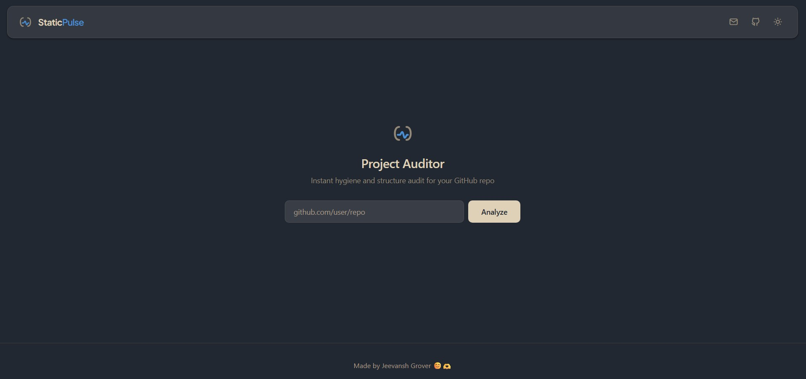
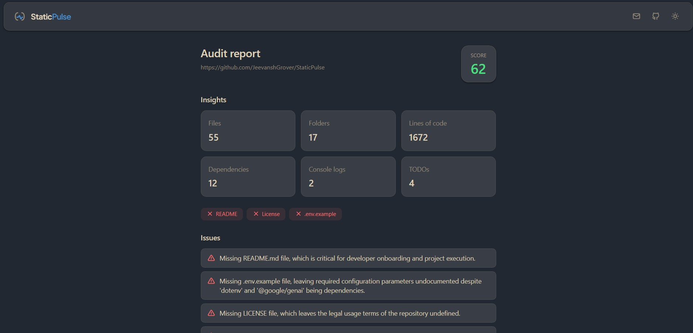
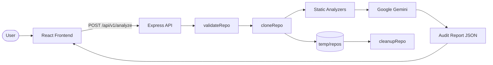

# StaticPulse

StaticPulse is a full-stack web app that audits public GitHub repositories for hygiene and structure. Paste a repo URL, and the app clones the repository, runs static analyzers, enriches the results with AI-generated insights, and presents an actionable audit report in the browser.

**Live app:** [staticpulse-v1.vercel.app](https://staticpulse-v1.vercel.app)

## Overview

Maintaining repository quality—documentation, licensing, dependency hygiene, and code cleanliness—takes time. StaticPulse automates a first-pass review so developers, maintainers, and reviewers can quickly spot gaps before deeper manual review.

### Primary use case

Analyze a **public GitHub repository** and receive:

- Static metrics (files, folders, lines of code, dependencies, console logs, TODOs)
- Hygiene checks (README, license, `.env.example`)
- An AI-generated score, issues, suggestions, strengths, and weaknesses

### Key features

- **GitHub URL validation** on the client and server
- **Shallow clone** of public repos with timeout handling
- **Parallel static analyzers** that tolerate individual analyzer failures
- **Gemini-powered report** with graceful fallback when AI is unavailable
- **Responsive dashboard** with dark/light theme support
- **Temporary repo cleanup** after each analysis

## Preview

| Landing page | Audit report |
| --- | --- |
|  |  |

*Left: enter a public GitHub repository URL. Right: view metrics, hygiene checks, and AI-generated findings.*

## Architecture

StaticPulse is a **monorepo** with a React frontend and an Express backend. The backend clones repositories to a temporary directory, runs filesystem-based analyzers, calls Google Gemini with the collected metrics, and returns a combined report. No database is used.



### Data flow

1. The user submits a public GitHub URL from the landing form.
2. The frontend sends `POST /api/v1/analyze` with `{ repoUrl }`.
3. The backend validates the URL, shallow-clones the repo into `Backend/temp/repos/`, and runs analyzers in parallel.
4. Metrics are sent to Gemini (`gemini-3.5-flash`) via `@google/genai`. If the AI call fails or times out, a static fallback report is returned.
5. The cloned repo is deleted in a `finally` block.
6. The frontend renders the dashboard (score, metrics, issues, suggestions, strengths, weaknesses).

### External integrations

| Service | Role |
| --- | --- |
| **GitHub** | Public repository source (cloned via `simple-git`) |
| **Google Gemini** | Generates score and narrative audit findings from metrics |

## Project structure

```
StaticPulse/
├── Frontend/                 # React + Vite UI
│   ├── src/
│   │   ├── api/              # Backend API client
│   │   ├── assets/           # Screenshots and static assets
│   │   ├── components/       # UI components (Dashboard, Navbar, etc.)
│   │   └── hooks/            # Theme hook
│   ├── public/               # Favicon and public assets
│   └── .env.example          # Frontend environment template
├── Backend/                  # Express API
│   ├── src/
│   │   ├── controllers/      # Route handlers
│   │   ├── routes/           # Express routers
│   │   ├── services/
│   │   │   ├── analysis/     # Static analyzer pipeline
│   │   │   ├── ai/           # Gemini integration and prompt
│   │   │   └── github/       # URL validation and cloning
│   │   ├── middleware/       # Global error handler
│   │   └── utils/            # ApiError, ApiResponse, temp cleanup
│   └── .env.example          # Backend environment template
└── README.md
```

## Tech stack

| Layer | Technologies |
| --- | --- |
| **Frontend** | React 19, Vite 8, Tailwind CSS 4, Tabler Icons |
| **Backend** | Node.js, Express 5, CORS, dotenv |
| **Analysis** | Custom filesystem analyzers (`fs`, dependency parsing) |
| **Git** | `simple-git` (shallow clone) |
| **AI** | `@google/genai` (Gemini) |
| **Tooling** | ESLint (frontend), Nodemon (backend dev) |

There is **no database** and **no automated test suite** in the current repository.

## Getting started

### Prerequisites

- **Node.js** 18+ (LTS recommended)
- **npm**
- A **Google Gemini API key** for AI-powered reports
- **Git** available on the machine running the backend (used by `simple-git`)

### 1. Clone the repository

```bash
git clone https://github.com/JeevanshGrover/StaticPulse.git
cd StaticPulse
```

### 2. Backend setup

```bash
cd Backend
cp .env.example .env
npm install
```

Edit `Backend/.env`:

| Variable | Required | Description |
| --- | --- | --- |
| `GEMINI_API_KEY` | Yes | Google Gemini API key |
| `PORT` | No | Server port (default: `5000`) |
| `CORS_ORIGIN` | No | Allowed frontend origin. Defaults to `http://localhost:5173` in development |

Start the API:

```bash
npm run dev
```

The server runs at `http://localhost:5000`.

### 3. Frontend setup

In a second terminal:

```bash
cd Frontend
cp .env.example .env
npm install
npm run dev
```

The UI runs at `http://localhost:5173`. In development mode, the frontend calls `http://localhost:5000/api/v1` automatically—`VITE_API_URL` is only used for production builds.

For production builds, set in `Frontend/.env`:

```env
VITE_API_URL=https://your-backend-host/api/v1
```

### Build commands

```bash
# Frontend production build
cd Frontend
npm run build
npm run preview   # optional local preview of dist/

# Backend production start
cd Backend
npm start
```

## Usage

### Web workflow

1. Open the app and enter a public GitHub URL (e.g. `https://github.com/user/repo`).
2. Click **Analyze** and wait while the app clones, scans, and generates the report.
3. Review the audit dashboard: score, metrics, hygiene pills, issues, and suggestions.
4. Click **Analyze another** to run a new audit.

### API

#### Health check

```bash
curl http://localhost:5000/api/v1/health
```

#### Analyze a repository

```bash
curl -X POST http://localhost:5000/api/v1/analyze \
  -H "Content-Type: application/json" \
  -d '{"repoUrl":"https://github.com/user/repo"}'
```

Successful responses wrap data in the backend's standard envelope:

```json
{
  "statusCode": 200,
  "data": {
    "metrics": { "...": "..." },
    "score": 72,
    "issues": [],
    "suggestions": [],
    "strengths": [],
    "weaknesses": []
  },
  "message": "repository analyzed successfully",
  "success": true
}
```

### Static metrics collected

| Metric | Source |
| --- | --- |
| File / folder counts | Filesystem scan |
| Lines of code | LOC analyzer |
| README present | Root filename check |
| License present | Root filename check |
| `.env.example` present | Root filename check |
| Console log count | Source file scan |
| TODO count | Source file scan |
| Dependency count | `package.json` / lockfile parsing |

## Development

### Where to make changes

| Area | Location |
| --- | --- |
| UI / styling | `Frontend/src/components/`, `Frontend/src/index.css` |
| API client | `Frontend/src/api/analyzeRepo.js` |
| Routes & controllers | `Backend/src/routes/`, `Backend/src/controllers/` |
| Static analyzers | `Backend/src/services/analysis/analyzers/` |
| AI prompt & integration | `Backend/src/services/ai/` |
| Clone / validation | `Backend/src/services/github/` |

### Linting

```bash
cd Frontend
npm run lint
```

The backend does not define a lint script.

### Contribution

There is no `CONTRIBUTING.md` in this repository. To contribute, open an issue or pull request on [GitHub](https://github.com/JeevanshGrover/StaticPulse).

## Deployment notes

The codebase is configured for a split deployment:

- **Frontend:** static hosting (e.g. Vercel). Set `VITE_API_URL` to your deployed backend base path.
- **Backend:** Node hosting (e.g. Render). Set `GEMINI_API_KEY` and `CORS_ORIGIN` to your frontend URL (**no trailing slash**).

Ensure the backend can write to `Backend/temp/repos/` for cloning, and that Git is available in the runtime environment.

## Support

- **Repository:** [github.com/JeevanshGrover/StaticPulse](https://github.com/JeevanshGrover/StaticPulse)
- **Contact:** [groverjeevansh0243@gmail.com](mailto:groverjeevansh0243@gmail.com)
- **Issues:** [GitHub Issues](https://github.com/JeevanshGrover/StaticPulse/issues)

No separate `docs/` directory or wiki is included in this repository.

## Maintainer

**Jeevansh Grover** — [GitHub](https://github.com/JeevanshGrover) · [Email](mailto:groverjeevansh0243@gmail.com)

## License

The backend `package.json` declares the **ISC** license. A root `LICENSE` file is not included in this repository.
